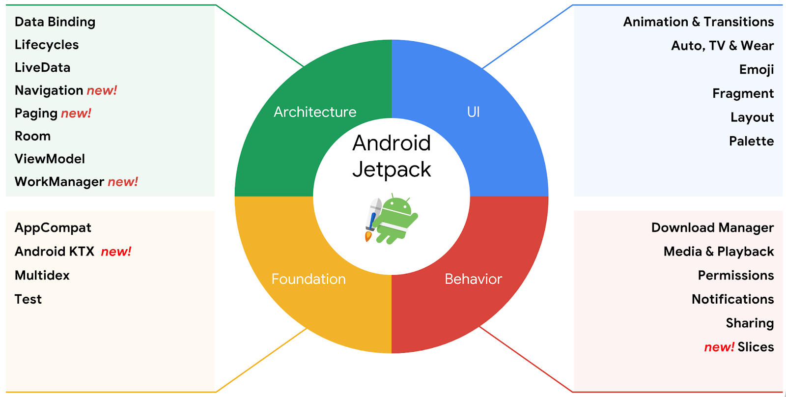
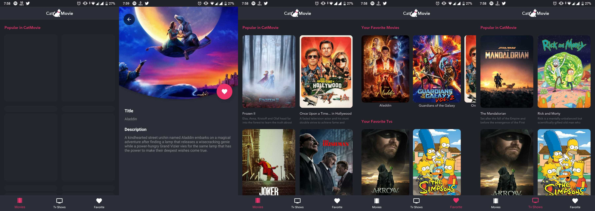

Android Jetpack
Pada I/O 2018, Google resmi mempublikasikan Android Jetpack. Android Jetpack sendiri adalah kumpulan library, tools, architecture guidance yang dapat membantu proses pengembangan aplikasi android dengan lebih mudah dan cepat. 

Jetpack terdiri dari beberapa paket library androidx.*, yang tidak terpaket dengan API platform. Jetpack menawarkan kompatibilitas dengan versi sebelumnya dan lebih sering diperbarui dibandingkan platform Android. Alhasil, Anda selalu dapat mengakses versi komponen Jetpack yang terbaru dan terbaik.
sumber [dicoding.com](https://www.dicoding.com/academies/129/ "dicoding.com")

Pada kali ini saya mengikuti course Belajar Android Jetpack Pro dari dicoding,
pertama saya mempelajara fundamental jetpack itu sendiri kemudian disusul dengan MVVM, AndroidX, LiveData, Pagination, Testing dan Room

untuk submissin terakhir ini saya diharuskan

**Kriteria**
Fitur yang harus ada pada aplikasi:

**Daftar film**
Syarat:
Mempertahankan fitur sebelumnya.

Detail tv
Syarat:
Mempertahankan fitur sebelumnya.

**Favorite Film**
Syarat:
Dapat menyimpan film ke database favorite.
Dapat menghapus film dari database favorite.
Terdapat halaman untuk menampilkan daftar Favorite Movies.
Terdapat halaman untuk menampilkan daftar Favorite Tv Show.
Menerapkan Room menyimpan data Favorite Movie dan Favorite Tv Show.
Menerapkan Pagination untuk mengatur data pada RecyclerView.

**Unit Test**
Syarat:
Menerapkan unit test pada semua fungsi yang digunakan untuk mendapatkan data Movie dan Tv Show dari API atau Lokal.

**Instrumentation Tests**
Syarat:

Menerapkan instrumentation test untuk memastikan fitur-fitur yang ada berjalan dengan semestinya.
Jika pada aplikasi terdapat proses asynchronous, maka Anda wajib menerapkan Idle Resources.
Tuliskan skenario instrumentation test pada kolom Catatan ketika Anda ingin mengumpulkan tugas ini. Untuk format penulisan sekenario pengujian, Anda bisa melihat contoh di modul Proyek Academy : Pengujian ViewModel.

untuk aplikasi ini sendiri saya menggunakan beberapa library seperti :
-  [ButterKnife](https://jakewharton.github.io/butterknife/ "ButterKnife")
- [ArcLayout](https://github.com/florent37/ArcLayout "ArcLayout")
- [Shimmer](https://github.com/facebook/shimmer-android "Shimmer")
- [Retrofit](https://square.github.io/retrofit/ "Retrofit")
- [Glide](https://github.com/bumptech/glide "Glide")

